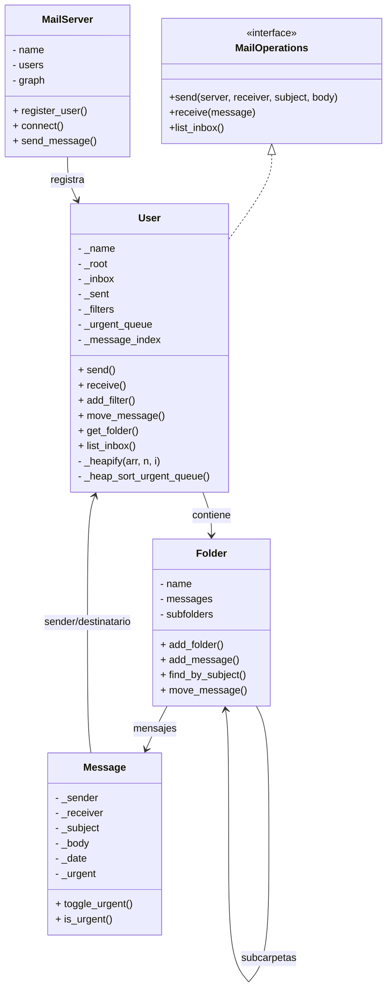

# 📧 Cliente de Correo Electrónico (Email Client)

## ℹ️ Trabajo Final para la Cátedra: *Estructuras de Datos*  
**Universidad Nacional Almirante Brown (UNaB)**  
**Profesor:** Dr. Diego Agustín Ambrossio

---
## 💻 Tecnologías Utilizadas
- **Lenguaje**: Python 3.10+
- **Estructuras de Datos**:
 - Árboles Generales (gestión de carpetas)
 - Colas de Prioridad con Heap (mensajes urgentes)
 - Grafos (red de servidores)
- **Algoritmos**:
 - Recursividad (búsquedas en árbol)
 - BFS/DFS (enrutamiento de mensajes)
 - Heapsort (ordenamiento por prioridad)
- **GUI**: tkinter
- **Testing**: pytest
- **Control de Versiones**: Git/GitHub

## 🧠 Descripción General

Sistema de gestión de correo electrónico implementado en Python utilizando
estructuras de datos avanzadas y algoritmos eficientes. El proyecto modela un
cliente de correo completo con gestión de usuarios, mensajes, carpetas
recursivas, filtros automáticos y una red distribuida de servidores.

**El sistema permite:**

- Crear y gestionar usuarios
- Enviar y recibir mensajes
- Organizar mensajes en un árbol de carpetas
- Aplicar filtros automáticos que clasifican correos
- Manejar una cola de urgencia (prioridad)
- Buscar mensajes recursivamente
- Entregar mensajes en una red modelada como grafo usando BFS

---
##  Instrucciones de Uso

1.  **Requisitos del Sistema**

    Es necesario tener instalado **Python 3.x** o una versión superior. Podés verificar tu versión con el comando `python --version`.

2.  **Instalación**

    Primero, clone el repositorio en su máquina local ejecutando el siguiente comando en su terminal:

    ```bash
    git clone https://github.com/Lautaacode/email_client.git
    ```

    Una vez clonado, navegue hasta la carpeta del proyecto:

    ```bash
    cd email_client

    ```
    
3.  **Ejecución**

    Para iniciar el cliente de correo, ejecute el archivo principal del proyecto:

    ```bash
    python main.py
    ```
---
## 🏗️ Arquitectura del Proyecto

```
.
├── docs/
│   ├── user_manual.pdf
├── models/
│   ├── message.py
│   ├── folder.py
│   ├── user.py
│   ├── mail_server.py
│   └── __init__.py
├── interfaces/
│   ├── mail_operations.py
│   └── __init__.py
├── utils/
│   ├── letter.ico
├── __init__.py
├── main.py
└── README.md
```

---
## ⚙️ Principales Clases

| Clase | Descripción |
|-------|--------------|
| 🖥️ `MailServer` | **1.** Registra usuarios |  
|| **2.** Modela un grafo de conexiones |  
|| **3.** Entrega mensajes mediante BFS |
|| **4.** Evita ciclos mediante un set de visitados |
| 👤 `User` | **1.** Envía y recibe mensajes |
|| **2.** Mantiene un árbol completo de carpetas |
|| **3.** Aplica filtros automáticos |
|| **4.** Usa una cola de urgencia |
|| **5.** Índice rápido de mensajes (diccionario) |
| 🗂️ `Folder`| **Estructura recursiva:** |
|| **1.** Contiene mensajes|
|| **2.** Contiene subcarpetas |
|| **3.** Soporta búsqueda DFS |
|| **4.** Permite mover mensajes entre carpetas |
| ✉️ `Message` | **1.** Remitente |
|| **2.** Destinatario |
|| **3.** Asunto |
|| **4.** Contenido |
|| **5.** Fecha |
|| **6.** Urgencia (True/False)|
| 🧩 `MailOperations` (Interfaz) | **1.** send() |
|| **2.** receive() |
|| **3.** list_inbox() |

---

## 🔁 Recursividad y Árbol de Carpetas

El sistema utiliza una **estructura recursiva** para representar las carpetas de cada usuario.

Cada `User` tiene un `Folder` raíz:
- Root
- Inbox
- Sent
- Carpetas creadas manualmente o por filtros

Cada `Folder` contiene:
- Subfolders (`List[Folder]`)
- Messages (`List[Message]`)

Esto constituye un árbol general, donde cada nodo puede tener muchos hijos.

El proyecto utiliza 4 funciones de recursividad:

**1.** Búsqueda de carpetas por nombre [User.get_folder()] (DFS) recorre:
- Carpeta actual.
- Subcarpetas.
- Subcarpetas de subcarpetas.

**2.** Búsqueda de mensajes por asunto [Folder.find_by_subject()]:
- Verifica los mensajes de la carpeta actual.
- Si no lo encuentra, prueba recursivamente en cada subcarpeta.
- Retorna el primer mensaje encontrado.

**3.** Movimiento de mensajes en el árbol [Folder.move_message()]:
- Recorre el árbol completo buscando el mensaje.
- Al encontrarlo:
    1. lo elimina de la carpeta original.
    2. lo inserta en la carpeta destino.
- Si no lo encuentra, continúa con subcarpetas recursivamente.
  
**4.** Mostrar estructura del árbol [print_tree()]:
- Imprime la carpeta actual.
- Llama recursivamente a cada subcarpeta, aumentando la indentación.

---

## 🧮 Análisis de Eficiencia

| Operación | Complejidad | Justificación |
|------------|-------------|---------------|
| Enviar mensaje | O(1) | Inserción en la carpeta “Sent” + encolar urgencia. |
| Enviar mensaje urgente | O(n log n) | Se agrega a la cola de urgencia y se aplica HeapSort completo. |
| Recibir mensaje | O(1) | Inserción directa en “Inbox”. |
| Buscar por asunto | O(n) | Recorrido DFS de todos los mensajes en el árbol. |
| Mover mensaje | O(n) | Búsqueda + relocalización |
| BFS de entrega | O(V+E) | Recorre recursivamente todos los mensajes en el árbol.|


> Donde **n** representa la cantidad total de mensajes en el conjunto de carpetas del usuario,
> **v** representan los servidores y la *e* las conexiones.

---

## ⚠️ Casos Borde y Manejo de Excepciones

- **Usuario inexistente:** MailServer.send_message() verifica si el receptor existe,si no existe, retorna False y el mensaje no se entrega.
- **Carpeta destino no encontrada:** Si el servidor intenta entregar un mensaje usando BFS pero no hay ruta entre remitente y receptor.Si no encuentra el receptor, retorna False, luego se prueba entrega local.Si tampoco es posible, el mensaje no se entrega
- **Carpetas vacías:** Cuando se intenta mover un mensaje a una carpeta que no existe,el método User.move_message() llama a get_folder(). Si get_folder retorna None, el método devuelve False. 
- **Mensajes no encontrados:** El método Folder.move_message() recorre mensajes de la carpeta actual y subcarpetas recursivamente, si no encuentra el mensaje, retorna False sin modificar nada.
- **Estructura vacía:** Incluso si un usuario no tiene carpetas adicionales el método print_tree() recorre subcarpetas (lista vacía) y muestra correctamente la estructura sin lanzar errores..

---

## 📊 Diagrama UML




## 👨‍💻 Autores

**Lautaro Blanco** - [lautaro.blanco.contacto@gmail.com] - Responsable: Totalidad del proyecto.
- Carrera: *Técnicatura en Programación*  
- Universidad Nacional Almirante Brown (UNaB)  
- Año: **2025**
